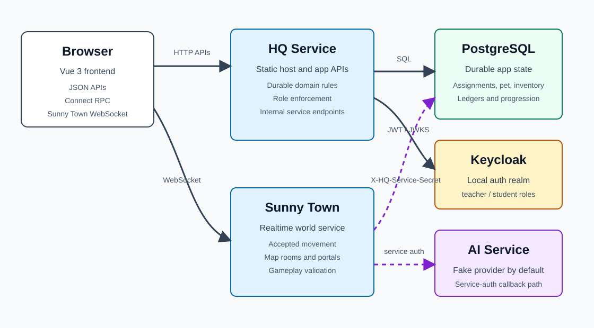
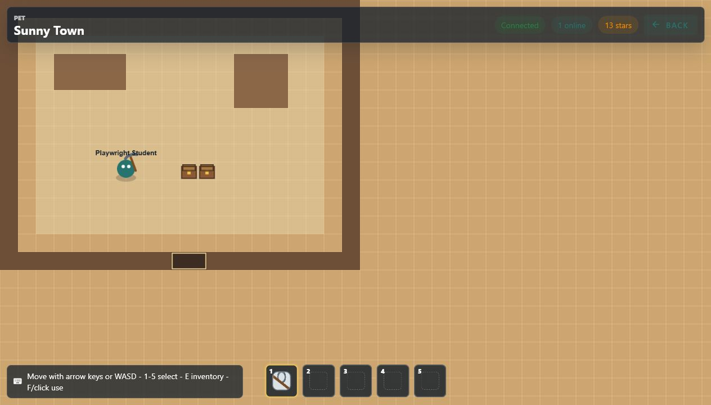
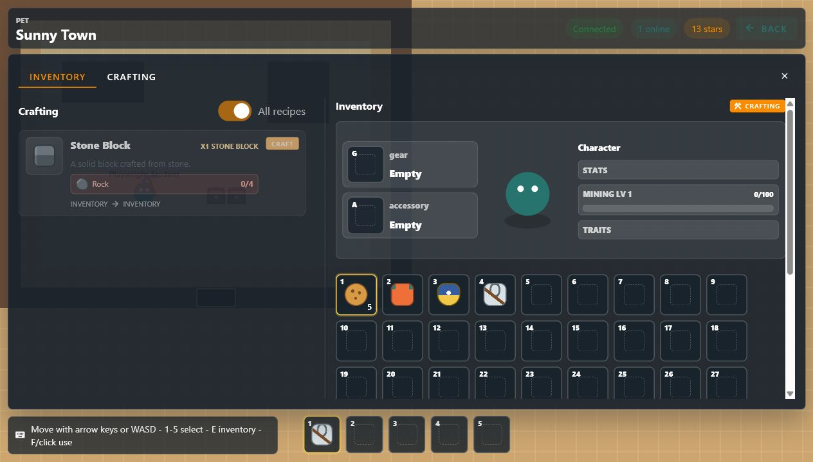
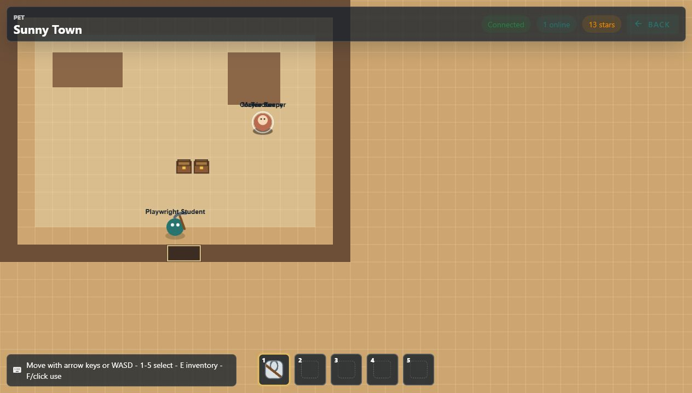

# HQ

HQ is a local-network learning app with a Go backend, Vue frontend, PostgreSQL persistence, Keycloak login, and a small realtime multiplayer world called Sunny Town.

The app is designed to run from a laptop on a home network. Teachers can create and grade schoolwork, students can answer assignments, care for a virtual pet, earn stars, manage inventory, and enter Sunny Town for realtime play, shops, resource gathering, and map interactions.

## Features

- Teacher and student login through Keycloak roles.
- Teacher workspace for creating, reviewing, grading, resetting, and deleting assignments.
- Student workspace for answering questions, reviewing grades, and seeing subject progress.
- Virtual pet state with food, happiness, energy, sleep, and live updates.
- Inventory, equipment, crafting, hotbar, wallet stars, and shop purchases.
- Sunny Town realtime WebSocket service with map rooms, portals, collectibles, NPCs, mining, placed blocks, and persisted return position.
- PostgreSQL-backed durable state with idempotent reward and inventory ledgers.

## Architecture Highlights



- HQ owns durable account, schoolwork, pet, wallet, inventory, equipment, map-object, NPC production, and progression state.
- Sunny Town owns realtime world state: connected players, accepted movement, map membership, portals, resource nodes, and gameplay validation.
- Browser and WebSocket messages are treated as requests. Gameplay effects are validated server-side against accepted position, ownership, active hotbar tools, and live world state.
- Durable Sunny Town effects cross into HQ through service-authenticated internal APIs with `X-HQ-Service-Secret`.
- Rewards, resource grants, shop stock production, and skill XP use idempotent ledgers so retries do not duplicate durable effects.
- Docker Compose starts the full reviewable runtime: HQ, Sunny Town, AI fake provider, PostgreSQL, and Keycloak.
- The repo keeps AI-assisted work reviewable through planning docs, GitHub issues, handoffs, verification commands, and current-state architecture docs.

## Stack

- Backend: Go 1.22
- Frontend: Vue 3, Vuetify, Pinia, Vite, TypeScript
- Realtime: Go WebSocket service
- Database: PostgreSQL 16
- Auth: Keycloak
- RPC: Connect RPC for pet service APIs
- Local runtime: Docker Compose

## Repository Layout

```text
cmd/hq/                 HQ binary startup, route composition, and static frontend host
cmd/sunny-town/         Sunny Town binary startup
cmd/ai/                 AI grading service
frontend/               Vue 3 frontend source
sunny-town/maps/        Sunny Town map JSON
proto/                  Protobuf definitions and generated Go code
internal/hq/            HQ domain, auth, schema, and HTTP helper packages
internal/sunnytown/     Sunny Town config, protocol, map, HQ client, and server packages
deploy/                 Docker Compose, Dockerfiles, Keycloak, database init
docs/                   Setup, testing, architecture, and feature notes
docs/current/           Current-state architecture, package boundaries, API, database, and runtime docs
docs/archive/           Historical planning docs
web/                    Ignored generated frontend build output
Taskfile.yml            Common verification and runtime commands
```

## Quick Start

Prerequisites:

- Docker Desktop
- Go 1.22+ for local backend tests and direct `go run`
- Node.js and npm for frontend development

Start the full local stack:

```powershell
docker compose -f deploy/docker-compose.yml up -d --build
```

Open:

```text
HQ app:        http://localhost:18080
Keycloak:      http://localhost:18081
Sunny Town:    http://localhost:18082
PostgreSQL:    localhost:55432
```

Keycloak admin login:

```text
admin / admin
```

Imported local demo users are available in a fresh Keycloak realm:

```text
Student: playwright-student / playwright
Teacher: playwright-teacher / playwright
```

You can also create users in the `hq` realm and assign the `student` and/or `teacher` realm roles. The frontend uses Keycloak login, and the Go backend validates bearer tokens and enforces roles server-side.

Important: use one consistent host for HQ and Keycloak. If you open HQ through `localhost`, keep the Keycloak issuer on `localhost`. If you open HQ through a LAN IP, set `HQ_PUBLIC_HOST` before starting Docker Compose as shown below.

## Demo Path

The strongest current demo is Sunny Town's Cookie Keeper life/work loop:



```text
student login
  -> Sunny Town
  -> full-viewport realtime world
  -> hotbar-selected pickaxe, mining, inventory, and progression
  -> Cookie Keeper traveling between home/rest and Cookie Shop work
```

Suggested reviewer flow:

1. Start the stack with Docker Compose.
2. Open `http://localhost:18080`.
3. Log in as `playwright-student` / `playwright`.
4. Enter Sunny Town from the student UI.
5. Open the inventory/character panels and note that the selected hotbar item is the active tool for mining.
6. Watch Cookie Keeper's routine cues:
   - `>` traveling
   - `W` working
   - `Z` resting
   - `!` blocked
7. Inspect authoritative routine state when needed:

   ```powershell
   Invoke-WebRequest `
     -UseBasicParsing `
     -Headers @{ "X-HQ-Service-Secret" = "local-dev-service-secret" } `
     http://127.0.0.1:18082/debug/npcs
   ```

8. Optionally log in as `playwright-teacher` / `playwright` to review the teacher workspace and schoolwork context.

More demo views:





## Local Network Use

For phone or tablet testing on the same Wi-Fi, set the public host to the laptop's LAN IP before starting Docker Compose. Replace the example address with the address shown by your machine:

```powershell
"HQ_PUBLIC_HOST=<YOUR_LAN_IP>" | Set-Content deploy/.env
docker compose -f deploy/docker-compose.yml up -d --build
```

Then open:

```text
http://<YOUR_LAN_IP>:18080
```

Use one consistent host/IP for HQ and Keycloak. A token issued for `localhost` will not match a browser session opened through the laptop LAN IP.

Keycloak imports the demo users only when the Keycloak database volume is initialized. If an older local volume already exists, create the users manually or reset the Keycloak volume using the workflow in [Current database](docs/current/DATABASE.md).

## Development

With Go Task installed, use the shared project commands:

```powershell
task test
task frontend:build
task compose:up
task health
task verify
```

Direct fallback commands are below.

Run backend tests:

```powershell
go test ./...
```

Run Sunny Town-only tests:

```powershell
go test ./cmd/sunny-town
```

Run HQ-only tests:

```powershell
go test ./cmd/hq
```

Install frontend dependencies:

```powershell
cd frontend
npm install
```

Run the frontend dev server:

```powershell
cd frontend
npm run dev
```

Build the production frontend bundle served by HQ:

```powershell
cd frontend
npm run build
```

The frontend production build writes ignored assets into `web/`.

## Health Checks

After starting or rebuilding services:

```powershell
Invoke-WebRequest -UseBasicParsing http://127.0.0.1:18080/healthz | Select-Object -ExpandProperty Content
Invoke-WebRequest -UseBasicParsing http://127.0.0.1:18082/healthz | Select-Object -ExpandProperty Content
```

Both services should return:

```text
ok
```

## Service Boundaries

HQ owns durable account, student, assignment, pet, wallet, inventory, equipment, map object, and saved Sunny Town position state.

Sunny Town owns live realtime world state: connected players, map room membership, accepted movement, live collectibles, resource nodes, portals, and gameplay validation.

Sunny Town does not write the HQ database directly. It calls internal HQ HTTP endpoints with `X-HQ-Service-Secret`.

## More Documentation

- [Current architecture](docs/current/ARCHITECTURE.md)
- [Current API surface](docs/current/API.md)
- [Current database](docs/current/DATABASE.md)
- [Current runtime](docs/current/RUNTIME.md)
- [Project setup](docs/PROJECT_SETUP.md)
- [Testing guidelines](docs/TESTING_GUIDELINES.md)
- [Sunny Town architecture](docs/SUNNY_TOWN_ARCHITECTURE.md)
- [Sunny Town movement model](docs/SUNNY_TOWN_MOVEMENT_MODEL.md)
- [Inventory API](docs/current/API.md)
- [Inventory database](docs/current/DATABASE.md)
- [Keycloak setup](docs/KEYCLOAK_SETUP.md)
- [Restructure implementation plan](docs/RESTRUCTURE_IMPLEMENTATION_PLAN.md)

## Notes

- `web/` is generated by `npm run build` and should not be committed.
- Local log files may appear in `git status`; they are development artifacts.
- Prefer Docker Compose for integration verification because it exercises HQ, Sunny Town, PostgreSQL, and Keycloak together.
